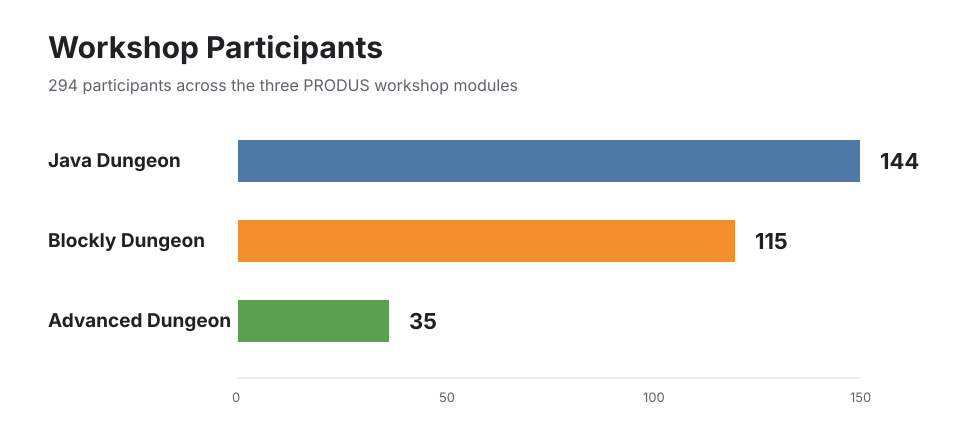
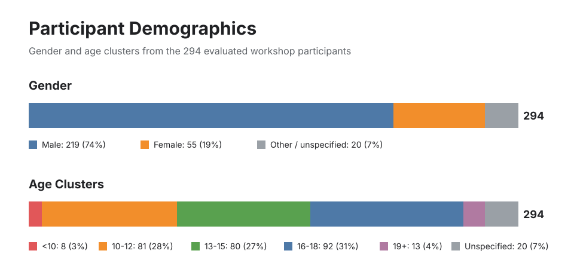

# PRODUS - Programming Dungeon Adventures at School

**PRODUS** is a project at Hochschule Bielefeld, Campus Minden. Its goal is to
spark early interest in computer science, programming, algorithms, and artificial
intelligence among school students. PRODUS combines game-based learning environments with
hands-on programming tasks, career orientation, and insights into real-world software work.
Herder-Gymnasium Minden published a German-language
[school report on Project PRODUS](https://www.herder-gymnasium-minden.de/allgemein/projekt-produs/)
in March 2026.

At the center of the project is the **Dungeon**: a 2D game world in which learners solve
puzzles, control characters, and apply programming concepts step by step. Based on this
framework, PRODUS developed three workshop formats for different levels of prior knowledge:

- **Blockly Dungeon** introduces programming logic through visual blocks.
- **Java Dungeon** bridges the gap from blocks to real Java code in Visual Studio Code.
- **Advanced Dungeon** offers more complex Java tasks, advanced puzzles, and AI-adjacent
  concepts.

## Workshop Modules

### Blockly Dungeon

Blockly Dungeon is designed for beginners. Learners control the game character through a
browser-based Blockly interface. This allows them to experiment with sequences, conditions,
loops, and variables without first having to deal with programming-language syntax.

### Java Dungeon

Java Dungeon uses the same game idea but introduces textual programming. A Visual Studio Code
extension sends Java code to the running Dungeon instance. This creates a gradual transition
from visual blocks to real programming languages, including editor workflows, files, and code
execution through an extension.

### Advanced Dungeon

Advanced Dungeon is aimed at learners with prior programming experience. Participants edit
prepared Java classes directly inside the project. Puzzles involving portals, light bridges,
laser walls, switches, and game logic make it visible how code creates behavior in a game
world.

<table>
  <tr>
    <td></td>
    <td></td>
  </tr>
</table>

## Usage

All variants require **Java 25**. Ready-to-use builds are available on the
[GitHub Releases page](https://github.com/Dungeon-CampusMinden/Dungeon/releases).

- **Start Blockly Dungeon:** Download `Blockly-web.jar` from the latest release, start it by
  double-clicking it or by running `java -jar Blockly-web.jar`, then open
  [http://localhost:8081/](http://localhost:8081/) in a browser.
- **Start Java Dungeon:** Download `Blockly-desktop.jar` and the VS Code extension (`.vsix`)
  from the latest release. Start the JAR, install the extension in Visual Studio Code via
  "Install from VSIX...", and send Java code to the game with the command
  `Blockly: Run Blockly-Code`.
- **Start Advanced Dungeon:** Clone the repository, open it in a Java IDE, and run it through
  Gradle: `./gradlew runPortal` on macOS/Linux or `.\gradlew.bat runPortal` on Windows.

Detailed step-by-step instructions are available in the
[PRODUS guide](doc/produs_unterlagen/readme.md). Additional Blockly and extension
documentation is available in the [Blockly documentation](blockly/doc/readme.md) and the
[extension documentation](blockly/vs-code-extension/README.md).

## Project Context and Funding

PRODUS stands for **Programming Dungeon Adventures at School**. The project runs from
**12/2024 to 08/2026** and connects the university, schools, companies, and extracurricular
education partners in the Ostwestfalen-Lippe region. Alongside programming content, career
and study orientation are an explicit part of the concept: students learn not only about code,
but also about people, roles, and pathways into computer science.

It is acknowledged that parts of the materials contained in this repository have been
developed as part of various publicly funded projects.

For PRODUS, the funding reference is: 12/2024 - 08/2026, EFRE-20300105,
[Pakt für Informatik 2.0], [EFRE/JTF NRW 2021--27].

The project aims to promote interest in STEM subjects - especially computer science - among
school students in the surrounding region. The primary goal is to inspire young learners to
consider a future path in computer science by engaging them in hands-on, game-based learning
experiences.

The project is a **collaborative effort** between local schools and companies in the OWL
(Ostwestfalen-Lippe) region, with HSBI providing both academic leadership and operational
coordination.

## Requirements

- [Java SE Development Kit 25 LTS](https://jdk.java.net/25/)
- For Java Dungeon: [Visual Studio Code](https://code.visualstudio.com/) and the
  Blockly Code Runner extension from the releases
- For Advanced Dungeon: Git and a Java IDE, for example IntelliJ IDEA

## Known Limitations

Currently, the path to the project files must not contain spaces, special characters, or
umlauts.

The project was developed as German-language teaching and workshop material. Questions,
problems, and suggestions are welcome in either German or English.

## What We Achieved

PRODUS turned the Dungeon framework into a coherent workshop series for different levels of
prior knowledge. Students can start without installing a development environment, later write
real Java code in Visual Studio Code, and eventually work on prepared Java classes in a full
IDE.

The workshops were conducted and evaluated with **294 participants**:

The evaluation includes **144** Java Dungeon participants, **115** Blockly Dungeon
participants, and **35** Advanced Dungeon participants.

Across the full evaluation, **219 male**, **55 female**, and **20 other or unspecified**
participants were represented. The age clusters show the breadth of the target group, from
participants younger than 10 to participants aged 19 or older.

## Credits

The assets in [`dungeon/assets/`] are a mix from free and self modified resources:

- Textures and animations:
  - https://0x72.itch.io/16x16-dungeon-tileset (CC0 1.0)
  - https://0x72.itch.io/dungeontileset-ii (CC0 1.0)
- Music and sound effects:
  - https://alkakrab.itch.io/free-12-tracks-pixel-rpg-game-music-pack (CC0 1.0)
  - https://opengameart.org/content/50-rpg-sound-effects (CC0 1.0)
  - https://opengameart.org/content/hurt-death-sound-effect-for-character (CC0 1.0)
  - https://opengameart.org/content/80-cc0-creture-sfx-2 (CC0 1.0)
  - https://freesound.org/s/578488/ (CC0 1.0)
- Adapted and modified by [@Flamtky]:
  - Files, except [Health Potion], in [`dungeon/assets/items/potion/`] originating from
    [@dkirshner]
  - Files in [`dungeon/assets/dungeon/*/floor`]: each `floor_damaged.png` originating from
    [@dkirshner]
  - [`dungeon/assets/dungeon/fire/floor/floor_1.png`] originating from [@dkirshner]

## Licenses

Unless otherwise noted, this [work] by [contributors] is licensed under [MIT].

[Pakt für Informatik 2.0]: https://www.efre.nrw/einfach-machen/foerderung-finden/pakt-fuer-informatik-20
[EFRE/JTF NRW 2021--27]: https://www.efre.nrw/
[`dungeon/assets/`]: dungeon/assets/
[@Flamtky]: https://github.com/Flamtky
[Health Potion]: dungeon/assets/items/potion/health_potion.png
[`dungeon/assets/items/potion/`]: dungeon/assets/items/potion/
[@dkirshner]: https://github.com/dkirshner
[`dungeon/assets/dungeon/*/floor`]: dungeon/assets/dungeon/
[`dungeon/assets/dungeon/fire/floor/floor_1.png`]: dungeon/assets/dungeon/fire/floor_1.png
[work]: https://github.com/Dungeon-CampusMinden/Dungeon
[contributors]: https://github.com/Dungeon-CampusMinden/Dungeon/graphs/contributors
[MIT]: LICENSE.md
